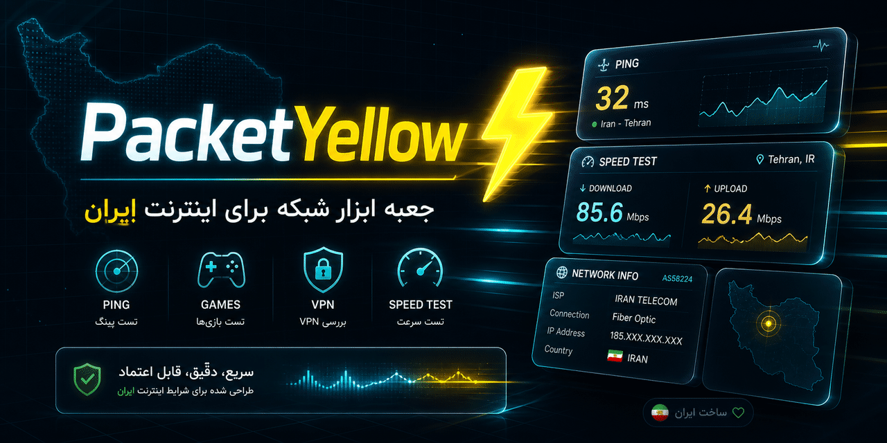
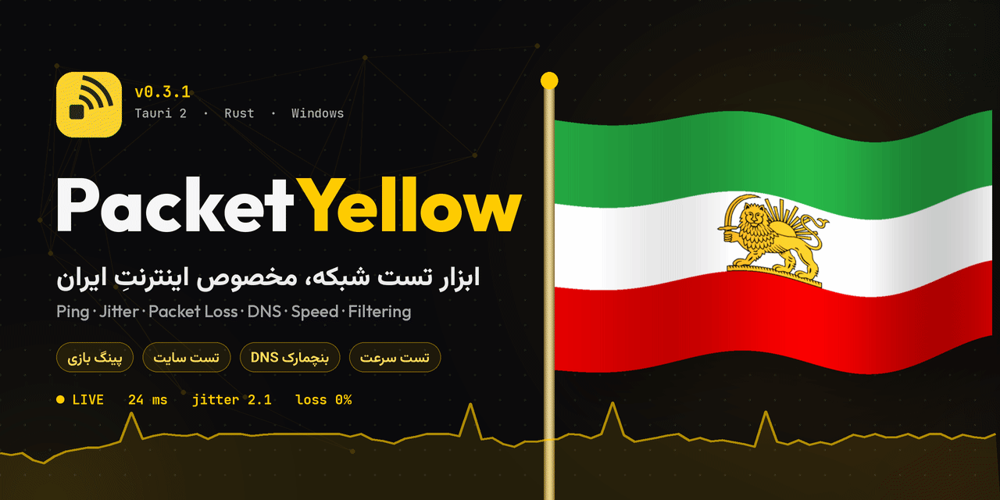

<div align="center">


<br/>

# 🟡 PacketYellow

**ابزار دسکتاپ تست شبکه، ساخته‌شده برای واقعیتِ اینترنت ایران**

*Ping · Jitter · Packet Loss · DNS · Speed · Filtering · Auto VPN detection: all measured natively in Rust*

<br/>


<br/>

[**⬇️ دانلود**](https://github.com/Mehdi138iimm/PacketYellow/releases/latest) &nbsp;•&nbsp;
[**🌐 سایت**](https://mehdi138iimm.github.io/PacketYellow/) &nbsp;•&nbsp;
[**✨ امکانات**](#-امکانات) &nbsp;•&nbsp;
[**🛡️ VPN خودکار**](#️-حالت-خودکار-تشخیص-vpn) &nbsp;•&nbsp;
[**🚀 اجرا**](#-اجرا-از-سورس) &nbsp;•&nbsp;
[**🧱 ساختار**](#-ساختار-پروژه) &nbsp;•&nbsp;
[**📝 تغییرات**](#-تغییرات)

</div>

<br/>

<div dir="rtl">

## 💡 چرا PacketYellow؟

اسپیدتست‌های معمولی فقط یه عدد بهت میدن. ولی تو ایران سؤال واقعی اینه: **چرا این سایت باز نمیشه؟ فیلتره، تحریمه یا قطعه؟ کدوم DNS الان جواب میده؟ پینگم تا سرور بازی چنده؟ پشت VPN عددی که می‌بینم راسته؟**

PacketYellow همه‌ی این‌ها رو یه‌جا جواب میده. همه‌ی اندازه‌گیری‌ها **فقط در Rust** انجام میشه و رابط کاربری فقط عدد واقعی رو نشون میده، بدون حدس و بدون عدد فیک.

<br/>

## ✨ امکانات

<p align="center"></p>

| | بخش | چی کار می‌کنه |
|:-:|---|---|
| 📈 | **داشبورد زنده** | پینگ لحظه‌ای، جیتر، پکت لاس و نمودار زنده (هر ثانیه یه تیک) + **حالت خودکار TCP / HTTP** |
| 🛡️ | **تشخیص خودکار VPN** 🆕 | هر ۴ ثانیه شبکه رو چک می‌کنه و پشت VPN خودش میره روی حالت HTTP، که عدد جعلی نبینی |
| 🌐 | **تست سایت‌ها** | ۴ مرحله: DNS، پینگ TCP، HTTPS، RTT واقعی + تشخیص دقیق دلیل: **فیلتر DNS** (`10.10.34.x`)، **فیلتر SNI/TLS**، **تحریم** (403/451)، قطعی، تایم‌اوت |
| 🎮 | **پینگ بازی‌ها** | **۲۶۶ بازی آنلاین** با جستجو و دسته‌بندی؛ سرورهای واقعی Supercell، Battle.net، Riot، Minecraft و لیست زنده‌ی Steam برای CS2 و Dota 2 |
| ⚡ | **تست سرعت** | ۴ اتصال دانلود / ۳ آپلود روی Cloudflare، حذف slow-start، تاخیر زیر بار (Bufferbloat)، حجم مصرفی |
| 🧭 | **بنچمارک DNS** | ۲۰ DNS آماده (Cloudflare، Google، Shecan، ...) + DNS دلخواه؛ میانه، کمینه، درصد موفقیت و تشخیص پاسخ فیلترشده |
| 🔐 | **سرورهای تونل** | پینگ لینک‌های `vless` / `vmess` / `trojan` / `ss` / `hysteria2` / `tuic` + حالت HTTP از داخل تونل و تشخیص Fake-IP |
| 🔎 | **اطلاعات شبکه** | IPv4/IPv6، ISP، ASN، شناسایی اپراتورهای ایرانی، تشخیص VPN / پروکسی / WARP / CGNAT، Wi‑Fi و هات‌اسپات، MTU و گیت‌وی |
| 🧾 | **لاگ** | خطاها و رویدادهای Rust و UI با فیلتر، جستجو، کپی و ذخیره (حتی panicها) |

<br/>

## 🛡️ حالت خودکار: تشخیص VPN

پشت VPN پینگ TCP دروغ میگه: یا به سرور VPN می‌خوره یا به یه آدرس جعلی. PacketYellow **هر ۴ ثانیه** شبکه رو نگاه می‌کنه و خودش بین TCP و HTTP جابه‌جا میشه. تو فقط بازیتو بکن.

| حالت | کی فعال میشه | چی می‌سنجه |
|---|---|---|
| **TCP** | بدون VPN | زمان دست‌دادن TCP تا سرور، دقیق‌ترین حالت ممکن |
| **HTTP** | VPN روشن | درخواست کوچیک روی یه اتصال باز از داخل تونل، پینگ واقعی نه عدد جعلی |

**نشونه‌هایی که بررسی میشن:**
- 🔌 آداپتور تونل (Wintun / TAP)
- 🧭 پروکسی سیستم روی `127.0.0.1`
- 🎭 Fake-IP حالت TUN (`198.18.x`)
- 🏢 IP خروجی دیتاسنتری
- 🛣️ روت‌های `0.0.0.0/1` (Full tunnel)
- ☁️ Cloudflare WARP

<br/>

## 🎨 طراحی

- 🌙 تم تیره با رنگ امضای **زرد**، بدون glow و سایه‌ی اضافه
- 🟡 **آیکون جدید** از نسخه‌ی 0.3.2
- 🇮🇷 رابط کاملاً **فارسی و راست‌چین** با فونت Vazirmatn
- 🔠 کمترین سایز متن 12px؛ پینگ لحظه‌ای بزرگ‌ترین عنصر صفحه
- 🪟 تایتل‌بار سفارشی، اسپلش و Onboarding شش‌مرحله‌ای انیمیشنی
- 📴 اجرای **بدون CDN** (فونت و آیکون‌ها با `npm run vendor` محلی میشن)

<br/>

## 🛠️ تکنولوژی

<p align="center">
  
</p>

| لایه | ابزار |
|---|---|
| هسته | Rust · Tokio · reqwest (rustls) · hickory-resolver · if-addrs |
| اپ دسکتاپ | Tauri 2 |
| رابط کاربری | HTML / CSS / JavaScript خالص (بدون React و Vite) · Lucide Icons |
| سایت | HTML تک‌فایلی روی GitHub Pages، ریلیزها رو زنده از API گیت‌هاب می‌خونه |

<br/>

## 🚀 اجرا از سورس

### پیش‌نیازها
1. [Rust](https://rustup.rs)
2. [Node.js LTS](https://nodejs.org)
3. ویندوز: **Microsoft C++ Build Tools** (Desktop development with C++) + **WebView2** (روی ویندوز ۱۰/۱۱ معمولاً نصبه)
4. VS Code با افزونه‌های `rust-analyzer` و `Tauri`

### دستورها

</div>

```bash
git clone https://github.com/Mehdi138iimm/PacketYellow.git
cd PacketYellow

npm install
npm run vendor                    # یک بار، با اینترنت: فونت و آیکون‌ها برای اجرای بدون CDN
npm run dev                       # حالت توسعه
npm run build                     # ساخت installer نهایی

npm run tauri icon app-icon.png   # (اختیاری) ساخت همه‌ی آیکون‌ها از روی لوگو
cd src-tauri && cargo test        # تست محاسبات جیتر و پکت لاس
```

<div dir="rtl">

<br/>

## 🧱 ساختار پروژه

</div>

```text
PacketYellow/
├── src-tauri/src/
│   ├── probe.rs      → کلاینت HTTP مشترک، تشخیص IP فیلتر و Fake-IP
│   ├── ping.rs       → پینگ TCP بدون نیاز به ادمین، پینگ موازی چند سرور
│   ├── stats.rs      → min / avg / max، جیتر، پکت لاس
│   ├── monitor.rs    → داشبورد زنده (event: monitor://tick) + حالت خودکار
│   ├── sites.rs      → تست دسترسی سایت‌ها + دلیل باز نشدن
│   ├── dns.rs        → بنچمارک DNS
│   ├── speed.rs      → تست سرعت دانلود / آپلود با پیشرفت زنده
│   ├── netinfo.rs    → IP عمومی، ISP، ASN، اینترفیس‌ها، تشخیص VPN
│   └── applog.rs     → لاگ داخلی اپ
├── ui/
│   ├── index.html    → ساختار رابط (RTL، تم تیره)
│   ├── style.css     → استایل
│   ├── main.js       → منطق رابط (فقط نمایش داده‌ی Rust)
│   └── games.js      → کاتالوگ بازی‌ها و منطقه‌ی سرورها
├── docs/
│   └── index.html    → سایت پروژه (GitHub Pages)
└── assets/           → بنرها و کاور README
```

<div dir="rtl">

<br/>

## 📝 تغییرات

<details open>
<summary><b>v0.3.2</b>: VPN زدی؟ خودش می‌فهمه</summary>

- 🛡️ **حالت خودکار:** تشخیص VPN هر ۴ ثانیه و جابه‌جایی خودکار بین TCP و HTTP
- 🔍 شش نشونه‌ی تشخیص: Wintun / TAP، پروکسی `127.0.0.1`، Fake-IP، IP دیتاسنتری، روت Full tunnel، WARP
- ⌨️ رفع تایپ نشدن توی فیلدهای هدف دلخواه، سایت و DNS
- 🎮 درست شدن اندازه‌ی جستجوی بازی‌ها
- 🟡 آیکون جدید
- 🌐 [سایت رسمی PacketYellow](https://mehdi138iimm.github.io/PacketYellow/) با دانلود مستقیم از ریلیزها
</details>

<details>
<summary><b>v0.3.1</b>: پایداری و دقت</summary>

- رفع نامرئی شدن UI وقتی انیمیشن‌های ویندوز خاموشه
- تست سرعت بازنویسی شد: سایز تطبیقی ۲۵→۱۰→۵→۱ مگ، تایم‌اوت، جلوگیری از دو تست همزمان، نمایش خطا به‌جای «0 Mbps»
- بخش **لاگ** (کلید `9`) با ثبت panicهای Rust
- اطلاعات شبکه با ۶ سرویس موازی، شناسایی اپراتورهای ایرانی با ASN، پروکسی سیستم و PAC، Wi‑Fi، هات‌اسپات
- پنجره دیگه maximize و زوم نمیشه
</details>

<details>
<summary><b>v0.3</b>: بزرگ‌ترین آپدیت</summary>

- تست سایت‌ها ۴ مرحله‌ای با تشخیص فیلتر DNS / SNI / تحریم
- ۲۶۶ بازی آنلاین + سرورهای واقعی
- حالت HTTP برای VPN و تشخیص Fake-IP در حالت TUN
- DNS دلخواه + ۲۰ DNS آماده
- تست سرعت چنداتصالی با بافربلوت
- Onboarding، اسپلش و بخش راهنما
</details>

<details>
<summary><b>v0.2</b>: رابط جدید</summary>

- UI تیره‌ی جدید با HTML/CSS/JS خالص
- انتقال همه‌ی اندازه‌گیری‌ها به Rust
- تایتل‌بار سفارشی و ذخیره‌ی تاریخچه
</details>

<br/>

## 🗺️ نقشه‌ی راه

- [x] تشخیص خودکار VPN و جابه‌جایی TCP / HTTP
- [x] سایت پروژه
- [ ] پینگ ICMP واقعی با `surge-ping`
- [ ] ذخیره‌ی تاریخچه با SQLite
- [ ] پارس کامل لینک‌های vless / vmess / trojan
- [ ] نمودارهای حرفه‌ای‌تر با uPlot

<br/>

## 🤝 مشارکت

ایده، باگ یا پیشنهاد داری؟ یه [Issue](https://github.com/Mehdi138iimm/PacketYellow/issues) باز کن یا Pull Request بفرست. اگه به کارت اومد، یه ⭐ بده که بیشتر دیده بشه.

</div>

<br/>

## 👥 سازنده‌ها

<table>
  <tr>
    <td align="center" width="180">
      <a href="https://github.com/Mehdi138iimm">
        <br/><br/>
        <b>Mehdi Jafari</b>
      </a><br/>
      <sub>مهدی جعفری</sub>
    </td>
  </tr>
</table>

<br/>

<div align="center">



<br/>

**ساخته‌شده با 💛 توسط [Mehdi Jafari](https://github.com/Mehdi138iimm)**

*برای ایران 🦁☀️*

</div>
